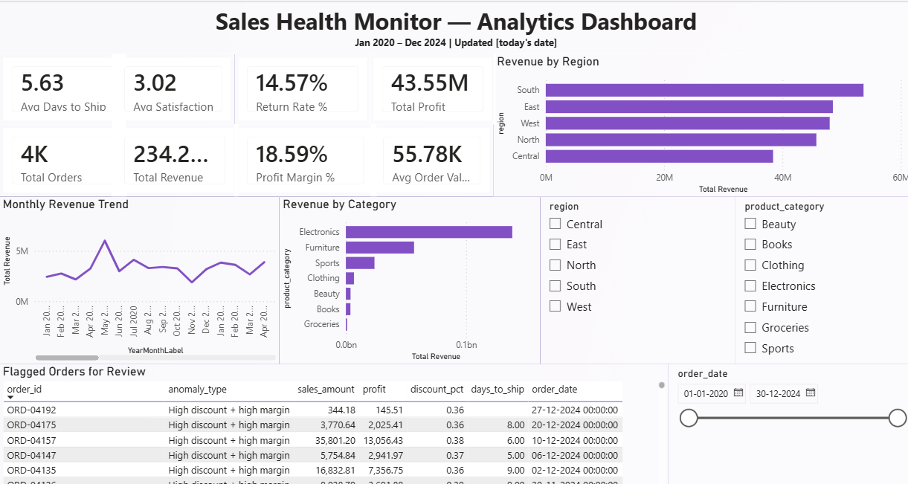

# Sales Health Monitor — Analytics Dashboard

**Personal Project** | Python · MySQL · SQL · Power BI · ETL · Data Analytics

An end-to-end sales analytics pipeline that takes a raw, deliberately messy retail sales dataset through cleaning, validation, relational storage, SQL-based analysis, and an interactive Power BI dashboard — with every data-quality decision documented and auditable.

---

## 1. Overview

This project simulates a real-world analytics workflow: a retail sales export (4,310 raw rows) contains missing values, corrupted sentinel codes, duplicate records, and inconsistent categorical data — the kind of mess analysts actually encounter. Rather than blanket-filling nulls, each column was diagnosed individually, and every imputation decision is both justified and flagged for transparency.

**Pipeline:** CSV → Python (pandas) cleaning/validation → MySQL (relational storage + SQL analysis) → Power BI (interactive dashboard with DAX measures)

### Dataset Source

Raw data: [Dataset name on Kaggle](PASTE_KAGGLE_URL_HERE) — License: `PASTE_LICENSE_HERE` (e.g. CC0: Public Domain)

The raw dataset is not redistributed in this repo; download it directly from the link above to reproduce the pipeline from scratch. The cleaned output (`data/clean_sales.csv`) **is** included, since it reflects substantial original transformation work documented in Section 3 below.

---

## 2. Tech Stack

| Layer | Tool |
|---|---|
| Extract & Transform | Python, pandas |
| Load / Storage | MySQL 8 |
| Analysis | SQL (aggregations, window functions, views) |
| Visualization | Power BI Desktop, DAX |

---

## 3. Data Cleaning & Validation (Python)

Starting point: 4,310 rows, 21 columns. Final output: **4,200 rows, 32 columns** (21 original + 11 derived/flag columns), exported to `clean_sales.csv`.

### 3.1 Structural issues
- **30 fully-blank rows** (every column NaN) — identified and dropped as export artifacts.
- **80 duplicate `order_id`s** — confirmed as exact full-row duplicates before dropping (not just matching IDs with different data).

### 3.2 Disguised missing data (sentinel values)
The dataset hid invalid data inside otherwise-valid-looking numeric columns:

| Column | Sentinel found | Action |
|---|---|---|
| `quantity` | `-1` and `999` (14 rows) | Converted to NaN, merged with 110 genuine nulls → 124 total |
| `age` | `-7` to `-1`, `150`, `999` (21 rows) | Converted to NaN, merged with 130 genuine nulls → 151 total |
| `shipping_cost` | Small negative values (2 rows) | Converted to NaN |

Each was diagnosed before fixing — e.g., confirmed the `quantity` recovery formula (`sales_amount / (unit_price × (1−discount))`) was unreliable on known-good rows before ruling it out, rather than assuming it would work.

### 3.3 Per-column imputation strategy (no blanket `fillna(0)`)

| Column | Missing | Strategy | Rationale |
|---|---|---|---|
| `quantity` | 124 | Median fill | Per-category medians were nearly identical (5–6), so a global median is safe |
| `discount_pct` | 137 | Median fill | Checked: `0` was *not* a dominant value in real data, so assuming "missing = no discount" would be unsupported |
| `age` | 151 | Median fill | Fixed a related binning bug (see below) |
| `customer_satisfaction` | 348 | **Left as NULL** | A rating scale — filling with a number would fabricate an opinion. Added `feedback_given` flag instead |
| `days_to_ship` | 100 | **Selective fill** (90 filled, 10 left NULL) | Cross-referenced `order_status`: orders that never shipped (Cancelled/Pending) correctly keep NULL; orders that did ship (Delivered/Shipped/Returned) were filled |

Every imputed column has a paired boolean flag (`quantity_imputed`, `age_imputed`, etc.) so any downstream analysis can isolate or exclude estimated values.

### 3.4 Categorical inconsistencies
- `order_status` and `gender` had mixed casing/abbreviations (`"Delivered"` vs `"delivered"`, `"Male"`/`"m"`/`"MALE"`) — standardized to clean, consistent categories.

### 3.5 Cross-column integrity check
Discovered that **4 rows** had `sales_amount`/`profit` values computed from the corrupted `quantity = 999` sentinel (one as high as ₹17.36M against a typical order of ~₹50K). These were recalculated from trustworthy fields (`unit_price`, `discount_pct`, corrected `quantity`) and an estimated profit margin derived from the rest of the dataset — flagged via `sales_amount_recalculated` rather than silently left wrong or silently dropped.

### 3.6 Bugs caught in the original derived-column logic
- **`age_group` binning bug:** bins were `[0,25,35,45,55,100]` labeled `['18-25', ...]` — meaning any customer under 18 would be mislabeled as "18-25." Fixed bin boundaries to match labels, which revealed **312 genuine under-18 customers** that had been silently miscategorized.
- **`returned` derivation bug:** original logic mapped `"Yes"/"No"` text to 1/0, but `return_flag` is actually a native boolean — that mapping would have silently produced `NaN` for every row. Replaced with a direct type cast.

---

## 4. SQL Analysis (MySQL)

### 4.1 Schema
Single flat `sales` table (32 columns) with `order_id` as `PRIMARY KEY` — chosen deliberately over a star schema for this dataset's scope, with the trade-off documented rather than defaulted into.

### 4.2 Core KPIs
| Metric | Value |
|---|---|
| Total Revenue | ₹234.26M |
| Total Profit | ₹43.55M |
| Profit Margin | 18.59% |
| Average Order Value | ₹55,775 |
| Return Rate | 14.57% |
| Avg. Customer Satisfaction | 3.02 / 5 |
| Avg. Days to Ship | 5.63 |

(`profit_margin_pct` computed as `SUM(profit)/SUM(sales_amount)`, not `AVG(profit/sales_amount)` — weighted by order size to avoid small orders distorting the overall margin.)

### 4.3 Anomaly Detection
- **Statistical (z-score):** Window-function query (`AVG()/STDDEV() OVER()`) flagging orders >3 standard deviations from the mean. Top outliers were cross-validated against known-legitimate high-ticket orders (confirming the method correctly distinguishes real outliers from data errors already fixed upstream).
- **Business-rule anomalies:**
  - Loss-making orders: **0** (healthy baseline)
  - High-discount + high-margin contradiction (>35% discount paired with >30% margin — logically inconsistent): **235 orders (~5.6%)**
  - Shipping delays >15 days: **5 orders**

### 4.4 Views
Four views encapsulate the recurring business logic for downstream consumption:
`v_monthly_sales_summary`, `v_category_performance`, `v_region_performance`, `v_anomalies`

---

## 5. Power BI Dashboard



- Connected directly to MySQL (granular `sales` table imported for full slicer/drill interactivity; `v_anomalies` imported as a row-level "flagged orders" table)
- **DAX measures:** Total Revenue, Total Profit, Total Orders, Avg Order Value, Profit Margin %, Return Rate %, Avg Satisfaction, Avg Days to Ship — all built with `DIVIDE()` for safe handling of zero-row filter states
- **Visuals:** KPI card header, monthly revenue trend (custom sortable Year-Month field built via DAX to avoid Power BI's date-hierarchy quirks), revenue by category, revenue by region, flagged-orders table
- **Interactivity:** Region, Category, and Date-Range slicers cross-filter the entire dashboard

---

## 6. Key Business Insights

1. **Electronics drives the most revenue (₹138.4M) but has the lowest margin (12.06%)** — worth investigating pricing or supplier cost structure.
2. **Beauty (45.1%), Clothing (35.2%), and Books (37.2%) margins are far higher** than Electronics, despite all 7 categories having nearly identical order volumes (~600 each) — the margin gap is driven entirely by category economics, not demand.
3. **Groceries has the weakest margin (7.85%)** of any category.
4. **~5.6% of orders show a discount/margin inconsistency** — a pattern large enough to suggest a possible discount-application issue at checkout, not just isolated noise, and worth a deeper audit.
5. **Zero loss-making orders and only 5 severely delayed shipments** — overall fulfillment and pricing discipline is healthy; the margin gap above is the standout opportunity.
6. **All 5 regions perform within a tight 18–19% margin band** — no regional underperformance to flag.

---

## 7. Project Structure

```
├── SalesDashboard.ipynb       # Python ETL: extract, clean, validate, transform
├── clean_sales.csv            # Cleaned output (4,200 rows × 32 columns)
├── sql/
│   ├── schema.sql              # CREATE TABLE + views
│   └── analysis_queries.sql    # KPI, trend, and anomaly-detection queries
├── SalesDashboard.pbix        # Power BI dashboard
└── README.md
```

---

## 8. How to Reproduce

1. Run `SalesDashboard.ipynb` end-to-end to produce `clean_sales.csv` from the raw source file.
2. Create the MySQL database/table using `sql/schema.sql`.
3. Load the cleaned data: `df.to_sql('sales', con=engine, if_exists='append', index=False)` (SQLAlchemy + pymysql).
4. Open `SalesDashboard.pbix` in Power BI Desktop and refresh the data source to point at your local MySQL instance.

---

## 9. What This Project Demonstrates

- Diagnosing missing/corrupted data *before* choosing a fix, rather than defaulting to blanket imputation
- Distinguishing genuine missing data from structurally-expected absence (e.g., a cancelled order legitimately having no shipping time)
- Documenting every data-quality decision with auditable flag columns
- Catching and fixing real logic bugs (age binning, boolean mapping) rather than just describing the data
- End-to-end pipeline ownership: Python → MySQL → SQL → Power BI, with consistent results validated at each handoff (Python totals = SQL totals = Power BI totals)
